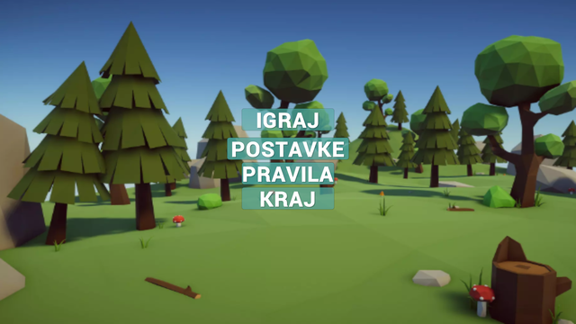
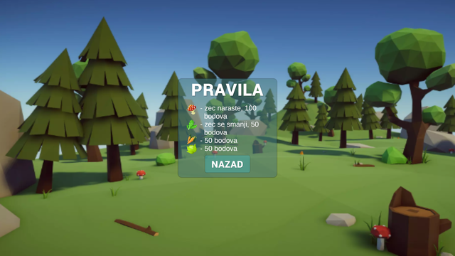
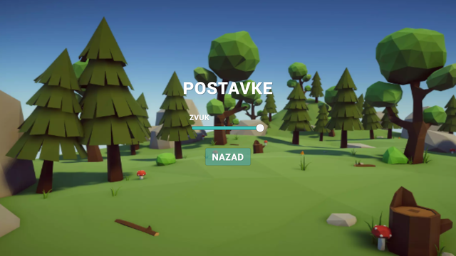
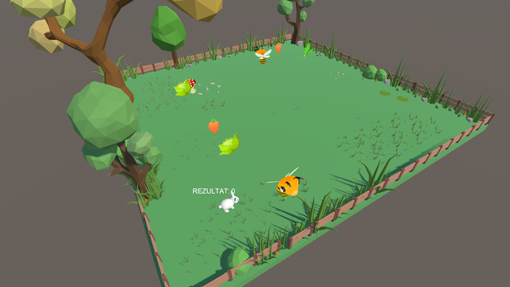

# RabbitHop

Ukoliko se kod otvaranja projekta u Unity-u pojave errori i warnings vezani za TextMeshPro,
potrebno je obrisati cache od tog dodatka, nakon toga se sve normalno builda i radi bez ikakvih problema

potrebno je obrisati ovu mapu: com.unity.test-framework@1.1.11 
Ta mapa se nalazi na putu: RabbitHop\Library\PackageCache

VEZANO ZA IGRU:
Kontrole za igru: 
kretanje:  
	lijevo - strelica u lijevo 
	desno - strelica u desno 
	gore - strelica za gore 
	dolje - strelica za dolje 
pauza - p  

Cilj: 
	sakupiti što više random spawnane hrane za zeca 
	ako pčela dotakne zeca - game over  

Pravila:  
	sakupljanje gljiva - poveća zeca, ali nosi 100 bodova 
	sakupljanje salate(listovi) - smanji zeca, nosi 50 bodova 
	sakupljanje mrkve i kupusa - 50 bodova 
	ako se dotakne pčelu, igra je gotova, vraća se na start menu

